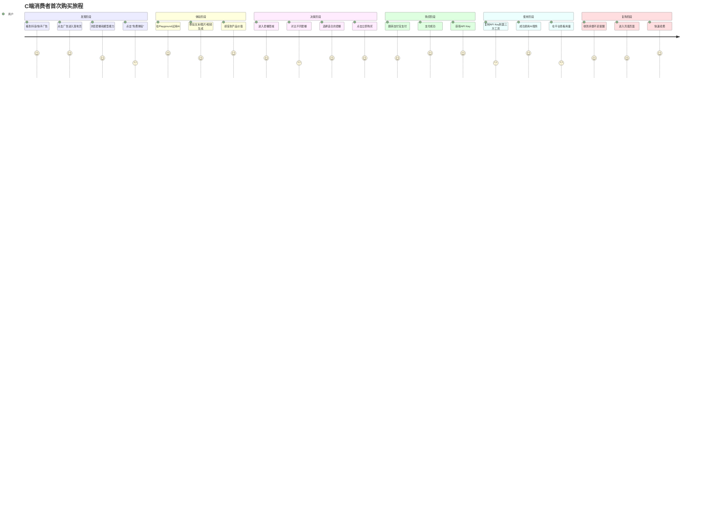
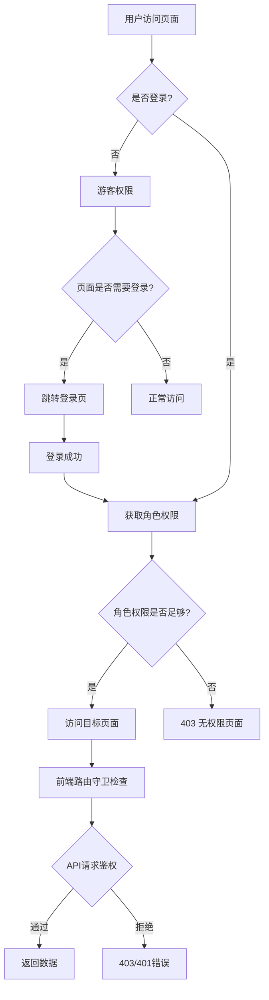
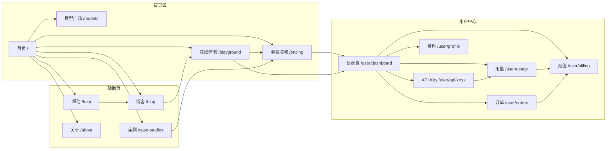
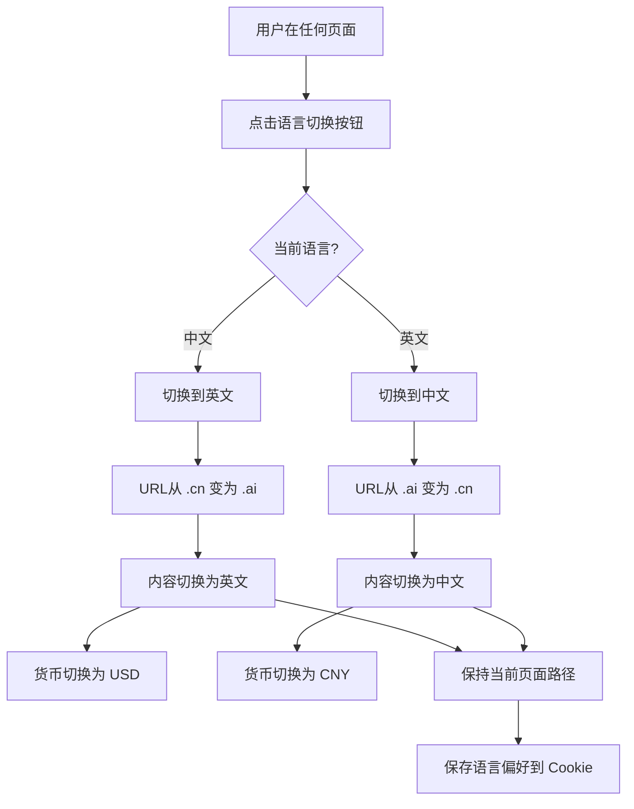
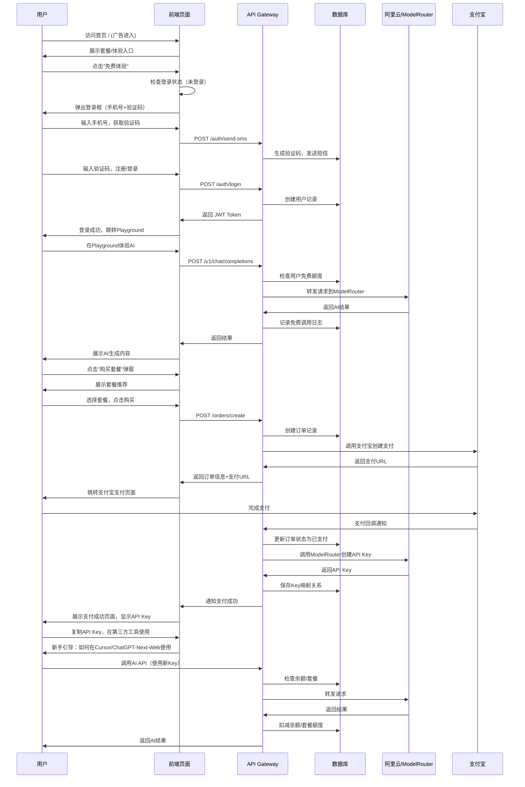
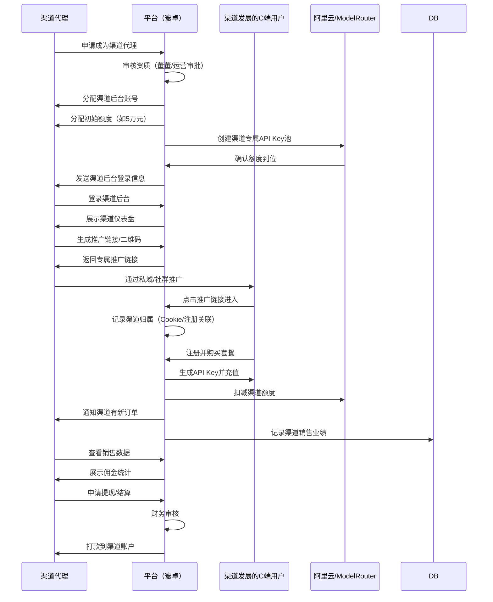
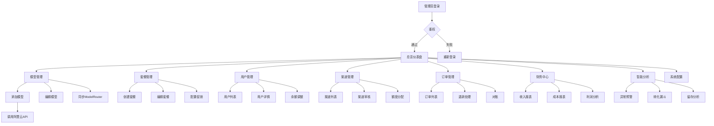
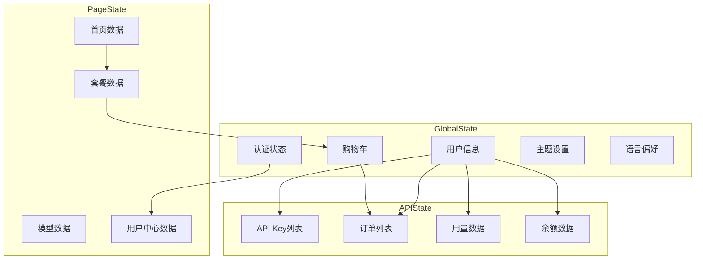

# 寰卓 网站架构文档

**版本**: v1.0  
**日期**: 2026-06-03  
**作者**: 小鹿 🦌  
**适用范围**: 中文版 (huazhuo.cn) + 英文版 (huazhuo.ai)  

---

## 1. 网站整体架构概览

```
┌──────────────────────────────────────────────────────────────────────────────┐
│                          寰卓 平台架构                                    │
│                                                                              │
│  ┌──────────────────┐  ┌──────────────────┐  ┌──────────────────┐            │
│  │   C端消费者门户   │  │  渠道代理商后台   │  │  平台管理后台     │            │
│  │  (Consumer)      │  │  (Channel)       │  │  (Admin)         │            │
│  │  前端: React     │  │  前端: React     │  │  前端: React     │            │
│  │  域名: tokenhub  │  │  域名: partner.  │  │  域名: admin.    │            │
│  └────────┬─────────┘  └────────┬─────────┘  └────────┬─────────┘            │
│           │                     │                    │                      │
│           └─────────────────────┼────────────────────┘                      │
│                                 │                                           │
│                    ┌────────────┴────────────┐                            │
│                    │     API Gateway          │                            │
│                    │     (FastAPI)            │                            │
│                    └────────────┬────────────┘                            │
│                                 │                                           │
│                    ┌────────────┴────────────┐                            │
│                    │   后端服务层 (微服务)     │                            │
│                    └────────────┬────────────┘                            │
│                                 │                                           │
│                    ┌────────────┴────────────┐                            │
│                    │   数据层 + 外部集成      │                            │
│                    └─────────────────────────┘                            │
└──────────────────────────────────────────────────────────────────────────────┘
```

---

## 2. 页面目录树 (Sitemap)

### 2.1 C端消费者门户（中文版）

```
huazhuo.cn/
│
├── /                     首页（Landing Page）
│   ├── Hero区域：AI能力展示 + 主推套餐
│   ├── 模型能力展示（文本/图片/视频）
│   ├── 套餐推荐（3-4个主推套餐）
│   ├── 信任背书（客户案例/数据）
│   └── CTA按钮：立即购买 / 免费体验
│
├── /pricing              套餐商城
│   ├── 套餐列表（网格/卡片视图）
│   ├── 套餐对比表
│   ├── 模型单价说明
│   └── 企业定制咨询入口
│
├── /pricing/:id          套餐详情页
│   ├── 套餐内容详情
│   ├── 适用模型列表
│   ├── 用量计算器
│   └── 立即购买按钮
│
├── /models               模型广场
│   ├── 模型列表（按类型：文本/图片/视频）
│   ├── 模型详情页
│   └── 在线体验入口
│
├── /playground           在线体验（Playground）
│   ├── 文本对话体验
│   ├── 图片生成体验
│   ├── 视频生成体验
│   └── 提示词模板库
│
├── /user                 用户中心（需登录）
│   ├── /dashboard        用户仪表盘
│   │   ├── API Key列表
│   │   ├── 余额/用量概览
│   │   └── 最近调用记录
│   ├── /api-keys         API Key管理
│   │   ├── Key列表（创建/复制/删除）
│   │   ├── Key余额详情
│   │   └── 调用统计
│   ├── /orders           订单管理
│   │   ├── 订单列表
│   │   ├── 订单详情
│   │   └── 发票申请
│   ├── /usage            用量明细
│   │   ├── 按模型统计
│   │   ├── 按时间统计
│   │   └── 用量趋势图
│   ├── /billing          充值/续费
│   │   ├── 快速充值
│   │   ├── 套餐升级
│   │   └── 充值记录
│   ├── /profile          个人资料
│   │   ├── 基本信息
│   │   ├── 安全设置
│   │   └── 通知偏好
│   └── /gpu-share        GPU闲时托管（寰卓融合）
│       ├── 托管设备列表
│       ├── 收益看板
│       └── 提现/抵扣
│
├── /order/:id            支付结果页
│   ├── 支付成功
│   └── 支付失败（重试入口）
│
├── /help                 帮助中心
│   ├── /faq              常见问题
│   ├── /tutorials        使用教程
│   ├── /docs             API文档
│   ├── /sdk              SDK下载
│   └── /contact          联系我们
│
├── /blog                 博客/资讯
│   ├── 文章列表
│   ├── 文章详情
│   └── 分类标签
│
├── /case-studies         案例研究
│   ├── 客户案例列表
│   └── 案例详情
│
├── /affiliate            推荐计划（分享赚佣金）
│   ├── 推荐链接生成
│   ├── 推荐统计
│   └── 佣金提现
│
├── /green-ai             绿色AI（差异化页面）
│   ├── 碳足迹追踪
│   ├── 绿色认证说明
│   └── 闲时算力介绍
│
└── /about                关于我们
    ├── 公司介绍
    ├── 合作伙伴
    ├── 媒体报道
    └── 加入我们
```

### 2.2 C端消费者门户（英文版）

```
huazhuo.ai/
│
├── /                     Home (Landing Page)
├── /pricing              Pricing Plans
├── /pricing/:id          Plan Details
├── /models               Model Library
├── /playground           AI Playground
├── /user                 User Center
│   ├── /dashboard        Dashboard
│   ├── /api-keys         API Keys
│   ├── /orders           Orders
│   ├── /usage            Usage Analytics
│   ├── /billing          Billing & Top-up
│   ├── /profile          Profile Settings
│   └── /gpu-share        GPU Sharing
├── /order/:id            Order Confirmation
├── /help                 Help Center
│   ├── /faq              FAQ
│   ├── /tutorials        Tutorials
│   ├── /docs             API Docs
│   ├── /sdk              SDKs
│   └── /contact          Contact Us
├── /blog                 Blog
├── /case-studies         Case Studies
├── /affiliate            Affiliate Program
├── /green-ai             Green AI Initiative
└── /about                About Us
```

### 2.3 渠道代理商后台（B端）

```
partner.huazhuo.cn/
│
├── /login                渠道登录
│
├── /dashboard            渠道仪表盘
│   ├── 额度余额概览
│   ├── 今日销售额
│   ├── 新增用户数
│   └── 佣金统计
│
├── /users                我的用户
│   ├── 用户列表
│   ├── 用户详情
│   └── 用户消费统计
│
├── /sales                销售数据
│   ├── 销售趋势图
│   ├── 套餐销售分布
│   └── 用户留存分析
│
├── /commission           佣金结算
│   ├── 佣金明细
│   ├── 结算记录
│   └── 提现申请
│
├── /marketing            营销工具
│   ├── 推广链接生成
│   ├── 推广素材下载
│   └── 二维码生成
│
├── /sub-agents           下级代理（多级分销）
│   ├── 代理列表
│   ├── 代理审批
│   └── 代理业绩
│
└── /settings             账户设置
    ├── 基本信息
    ├── 收款账户
    └── 安全设置
```

### 2.4 平台管理后台（Admin）

```
admin.huazhuo.cn/
│
├── /login                管理员登录
│
├── /overview             总览仪表盘
│   ├── 实时数据大屏
│   ├── 收入/成本/利润
│   ├── 用户增长趋势
│   └── 系统健康状态
│
├── /models               模型管理
│   ├── 模型列表
│   ├── 模型上架/下架
│   ├── 模型定价配置
│   └── ModelRouter同步
│
├── /packages             套餐管理
│   ├── 套餐列表
│   ├── 创建/编辑套餐
│   ├── 套餐销售统计
│   └── 促销配置
│
├── /users                用户管理
│   ├── C端用户列表
│   ├── 用户详情
│   ├── 余额调整
│   └── 用户封禁/解封
│
├── /channels             渠道管理
│   ├── 渠道列表
│   ├── 渠道审核
│   ├── 额度分配
│   └── 渠道结算
│
├── /api-keys             API Key管理
│   ├── 全量Key列表
│   ├── Key状态监控
│   ├── 强制停用
│   └── 批量操作
│
├── /orders               订单管理
│   ├── 订单列表
│   ├── 退款处理
│   └── 对账管理
│
├── /finance              财务中心
│   ├── 收入报表
│   ├── 成本报表
│   ├── 利润分析
│   ├── 渠道结算
│   └── 发票管理
│
├── /usage                用量监控
│   ├── 实时用量看板
│   ├── 模型调用排名
│   ├── 用户用量排名
│   └── 用量趋势分析
│
├── /billing-rules        计费规则
│   ├── 模型加价配置
│   ├── 折扣规则
│   ├── 促销规则
│   └── 渠道分润配置
│
├── /analytics            智能分析
│   ├── 异常预警
│   ├── 用户画像
│   ├── 转化率漏斗
│   ├── 留存分析
│   └── 预测分析
│
├── /marketing            营销管理
│   ├── 优惠活动配置
│   ├── 推荐计划管理
│   ├── 邮件模板管理
│   └── 公告管理
│
├── /content              内容管理
│   ├── 博客文章
│   ├── 帮助文档
│   ├── 页面文案
│   └── SEO配置
│
├── /system               系统配置
│   ├── 支付宝配置
│   ├── 短信配置
│   ├── 通知配置
│   ├── 安全策略
│   └── 系统参数
│
└── /logs                 日志审计
    ├── 操作日志
    ├── 登录日志
    ├── 调用日志
    └── 安全告警
```

---

## 3. 用户旅程地图 (User Journey Map)

### 3.1 C端消费者：从广告到首次购买



### 3.2 漏斗路径详细说明

| 阶段 | 页面路径 | 关键动作 | 转化目标 | 流失原因 | 优化策略 |
|------|----------|----------|----------|----------|----------|
| **曝光** | 抖音/快手/电商广告 → 落地页 | 点击广告 | 100% | 广告创意不吸引 | A/B测试广告素材 |
| **落地** | `/` 首页 | 停留 > 10s | 60% | 加载慢、内容不匹配 | 首屏优化、精准投放 |
| **兴趣** | `/` → `/playground` | 点击免费体验 | 25% | 不想注册、功能不够亮眼 | 免登录体验、更炫的Demo |
| **体验** | `/playground` | 完成一次AI调用 | 15% | 排队等待、效果不佳 | 优化响应速度、提供模板 |
| **意向** | `/playground` → `/pricing` | 查看套餐 | 10% | 价格太高、套餐不匹配 | 动态定价、个性化推荐 |
| **选择** | `/pricing` → `/pricing/:id` | 进入套餐详情 | 8% | 详情不够清晰 | 用量计算器、对比工具 |
| **购买** | `/pricing/:id` → 支付宝 | 点击立即购买 | 5% | 支付流程复杂 | 一键支付、花呗分期 |
| **支付** | 支付宝 → `/order/success` | 支付成功 | 4.5% | 支付失败 | 支付失败自动重试 |
| **激活** | `/order/success` → `/user/dashboard` | 复制API Key | 4% | 不知道如何使用 | 新手引导、视频教程 |
| **留存** | 第三方工具 → API调用 | 7日内再次调用 | 3% | 集成困难 | SDK、一键复制集成代码 |
| **复购** | 余额不足 → `/user/billing` | 30日内续费 | 2% | 流失到竞品 | 续费优惠、套餐升级提醒 |

### 3.3 用户从进入网站到完成支付的最短路径

```
最短路径A（直接购买）：
广告 → 首页「立即购买」 → 套餐商城 → 选择套餐 → 立即购买 → 支付宝支付 → 支付成功

最短路径B（先体验后购买）：
广告 → 首页「免费体验」 → Playground → 体验成功 → 弹窗引导购买 → 套餐商城 → 立即购买 → 支付宝支付 → 支付成功

最短路径C（搜索引擎/直接访问）：
搜索"AI API套餐" → 套餐详情页 → 立即购买 → 登录/注册 → 支付宝支付 → 支付成功

最短路径D（渠道推广）：
渠道推广链接 → 专属落地页 → 渠道优惠套餐 → 立即购买 → 支付宝支付 → 支付成功 → 自动绑定渠道关系
```

---

## 4. 权限流程与角色矩阵

### 4.1 用户角色定义

| 角色 | 英文标识 | 说明 | 核心权限 |
|------|----------|------|----------|
| **游客** | Guest | 未登录用户 | 浏览首页、套餐、模型、Playground（有限制） |
| **C端用户** | Consumer | 已注册个人用户 | 购买套餐、管理API Key、查看用量、充值续费 |
| **渠道代理商** | Channel | B端合作伙伴 | 管理下级用户、查看销售数据、佣金结算、发展下级代理 |
| **客服** | Support | 客服团队 | 查看用户订单、处理退款、回复工单、查看用户基本信息 |
| **运营** | Operator | 运营团队 | 套餐管理、模型管理、营销配置、内容管理、数据分析 |
| **技术** | Developer | 技术团队 | 系统配置、日志查看、API调试、监控告警、部署管理 |
| **董董/高管** | Executive | 高管/老板 | 查看财务报表、总览仪表盘、审批重大操作、全局数据 |
| **超级管理员** | SuperAdmin | 系统管理员 | 所有权限，包括用户管理、权限分配、系统设置 |

### 4.2 权限矩阵（RBAC模型）

| 功能模块 | 游客 | C端用户 | 渠道代理 | 客服 | 运营 | 技术 | 高管 | 超管 |
|----------|------|---------|----------|------|------|------|------|------|
| **浏览首页** | ✅ | ✅ | ✅ | ✅ | ✅ | ✅ | ✅ | ✅ |
| **浏览套餐** | ✅ | ✅ | ✅ | ✅ | ✅ | ✅ | ✅ | ✅ |
| **免费体验** | ⚠️(限5次) | ✅ | ✅ | ✅ | ✅ | ✅ | ✅ | ✅ |
| **购买套餐** | ❌ | ✅ | ✅ | ✅ | ✅ | ✅ | ✅ | ✅ |
| **管理API Key** | ❌ | ✅(仅自己) | ✅(渠道下) | ❌ | ✅(全量) | ✅(全量) | ❌ | ✅(全量) |
| **查看用量** | ❌ | ✅(仅自己) | ✅(渠道下) | ❌ | ✅(全量) | ✅(全量) | ✅(汇总) | ✅(全量) |
| **充值续费** | ❌ | ✅ | ✅ | ❌ | ❌ | ❌ | ❌ | ✅ |
| **渠道管理** | ❌ | ❌ | ✅(仅自己) | ❌ | ✅(全量) | ❌ | ✅(审批) | ✅(全量) |
| **用户管理** | ❌ | ❌ | ❌ | ✅(查看) | ✅(编辑) | ✅(调试) | ✅(查看) | ✅(全量) |
| **订单管理** | ❌ | ✅(仅自己) | ✅(渠道下) | ✅(处理) | ✅(全量) | ✅(查看) | ✅(查看) | ✅(全量) |
| **模型管理** | ❌ | ❌ | ❌ | ❌ | ✅ | ✅(配置) | ❌ | ✅ |
| **套餐管理** | ❌ | ❌ | ❌ | ❌ | ✅ | ❌ | ✅(审批) | ✅ |
| **财务管理** | ❌ | ✅(仅自己) | ✅(佣金) | ❌ | ❌ | ❌ | ✅(全量) | ✅(全量) |
| **系统配置** | ❌ | ❌ | ❌ | ❌ | ❌ | ✅ | ❌ | ✅ |
| **数据看板** | ❌ | ❌ | ✅(渠道) | ❌ | ✅(运营) | ✅(系统) | ✅(全局) | ✅(全量) |
| **内容管理** | ❌ | ❌ | ❌ | ❌ | ✅ | ❌ | ❌ | ✅ |
| **日志审计** | ❌ | ❌ | ❌ | ❌ | ❌ | ✅ | ✅(查看) | ✅ |
| **权限管理** | ❌ | ❌ | ❌ | ❌ | ❌ | ❌ | ❌ | ✅ |

> 图例: ✅ 完全权限 | ⚠️ 有限权限 | ❌ 无权限

### 4.3 权限控制流程图



### 4.4 董董/高管专属流程

```
高管登录 admin.huazhuo.cn
    │
    ▼
双重验证（密码 + 短信/邮箱验证码）
    │
    ▼
总览仪表盘（一键查看全局数据）
    │
    ├── 今日收入/本月收入/年收入
    ├── 实时用户活跃数
    ├── 渠道销售分布
    ├── 成本与利润趋势
    └── 系统健康状态
    │
    ▼
审批中心（待审批事项）
    ├── 大额渠道额度分配（>5万）
    ├── 套餐价格调整
    ├── 特殊退款申请
    └── 新渠道入驻审核
    │
    ▼
财务报表
    ├── 收入明细
    ├── 成本明细（阿里云账单）
    ├── 利润分析
    ├── 渠道结算汇总
    └── 税务报表导出
    │
    ▼
战略分析
    ├── 用户增长趋势
    ├── 竞品监控数据
    ├── 市场投放ROI
    └── 风险预警
```

---

## 5. 页面跳转逻辑 (Page Navigation Flow)

### 5.1 中文版页面跳转关系



### 5.2 中英版页面对应关系

| 中文页面 | 英文页面 | 说明 |
|----------|----------|------|
| `huazhuo.cn/` | `huazhuo.ai/` | 首页，内容本地化 |
| `huazhuo.cn/pricing` | `huazhuo.ai/pricing` | 套餐商城，货币/套餐本地化 |
| `huazhuo.cn/models` | `huazhuo.ai/models` | 模型广场，模型列表一致 |
| `huazhuo.cn/playground` | `huazhuo.ai/playground` | 在线体验，语言默认跟随站点 |
| `huazhuo.cn/user/*` | `huazhuo.ai/user/*` | 用户中心，同一套UI |
| `huazhuo.cn/help/*` | `huazhuo.ai/help/*` | 帮助文档，内容翻译 |
| `huazhuo.cn/blog` | `huazhuo.ai/blog` | 博客，内容独立运营 |
| `huazhuo.cn/case-studies` | `huazhuo.ai/case-studies` | 案例，案例本地化 |
| `huazhuo.cn/about` | `huazhuo.ai/about` | 关于我们，团队/联系方式本地化 |
| `huazhuo.cn/green-ai` | `huazhuo.ai/green-ai` | 绿色AI，全球统一叙事 |
| `huazhuo.cn/affiliate` | `huazhuo.ai/affiliate` | 推荐计划，佣金货币本地化 |
| `partner.huazhuo.cn/*` | `partner.huazhuo.ai/*` | 渠道后台，同一套系统 |
| `admin.huazhuo.cn/*` | `admin.huazhuo.ai/*` | 管理后台，同一套系统 |

### 5.3 语言切换机制



---

## 6. 关键业务流程页面流转

### 6.1 新用户注册 → 首次购买 → 首次调用



### 6.2 渠道代理业务流程



### 6.3 管理员后台操作流程



---

## 7. 响应式与多端适配

### 7.1 支持设备类型

| 设备 | 分辨率范围 | 适配策略 | 优先级 |
|------|------------|----------|--------|
| 桌面端 | 1280px+ | 完整布局，多列展示 | P0 |
| 平板端 | 768px-1280px | 自适应布局，双列 | P1 |
| 手机端 | <768px | 单列布局，汉堡菜单 | P0 |

### 7.2 关键页面移动端适配

- **首页**: 单列堆叠，Hero区缩小，套餐横向滑动
- **套餐商城**: 卡片单列，价格突出，一键购买
- **支付页**: 唤起支付宝App或H5支付
- **用户中心**: 底部Tab导航，各模块独立页面
- **Playground**: 输入框固定在底部，对话区域滚动
- **渠道后台**: 表格可横向滑动，关键数据卡片化
- **管理后台**: 优先支持桌面端，移动端仅查看仪表盘

---

## 8. SEO与URL规范

### 8.1 URL设计原则

| 原则 | 说明 | 示例 |
|------|------|------|
| 语义化 | URL包含关键词 | `/pricing/ai-creation-monthly` |
| 层级清晰 | 最多3层深度 | `/user/dashboard` |
| 静态化 | 使用slug而非ID | `/models/qwen-3-7` 而非 `/models/123` |
| 多语言 | 英文版独立域名 | `huazhuo.ai/pricing` |

### 8.2 关键页面SEO配置

| 页面 | Title | Meta Description | Keywords |
|------|-------|------------------|----------|
| 首页 | 寰卓 - 中国版OpenRouter，AI API套餐一站式购买 | 面向C端用户的AI API消费平台，提供文本、图片、视频生成能力，套餐化销售，即买即用 | AI API, 大模型API, Token购买, AI套餐 |
| 套餐页 | AI套餐商城 - 寰卓 | 19.9元起，包含文本、图片、视频AI生成能力，适合短剧创作者、自媒体、学生 | AI套餐, API充值, 模型调用 |
| 模型页 | 模型广场 - 通义千问/万相/快乐码 | 支持通义千问全系列、万相视频生成、快乐码等模型，一键接入 | 通义千问, 万相, 视频生成API |
| Playground | 免费体验AI - 寰卓 | 无需API Key，在线体验文本对话、图片生成、视频创作 | AI体验, 免费试用 |
| 帮助页 | 帮助中心 - API文档/教程 | 详细的使用教程、API文档、常见问题解答，快速上手寰卓 | API文档, 使用教程 |

---

## 9. 状态管理与数据流

### 9.1 前端状态架构



### 9.2 数据持久化策略

| 数据类型 | 存储位置 | 有效期 | 说明 |
|----------|----------|--------|------|
| JWT Token | LocalStorage | 7天 | 登录态保持 |
| 刷新Token | LocalStorage | 30天 | 自动刷新JWT |
| 用户偏好 | LocalStorage | 永久 | 语言、主题 |
| 购物车 | LocalStorage | 24h | 未支付订单 |
| API Key Secret | 内存 | 单次 | 创建时展示，不持久化 |
| 用量缓存 | IndexedDB | 7天 | 本地用量统计 |
| 通知已读 | LocalStorage | 永久 | 站内信阅读状态 |

---

## 10. 异常页面与状态

### 10.1 错误页面

| 页面 | 路径 | 触发场景 | 处理方式 |
|------|------|----------|----------|
| 404 | `/*` | 页面不存在 | 返回首页引导 |
| 403 | `/403` | 权限不足 | 提示升级权限或联系客服 |
| 500 | `/500` | 服务器错误 | 展示错误码，提供刷新按钮 |
| 维护中 | `/maintenance` | 系统维护 | 展示维护时间，提供订阅通知 |
| 支付失败 | `/order/failed` | 支付异常 | 显示失败原因，提供重试/联系客服 |

### 10.2 空状态设计

| 场景 | 空状态提示 | 引导操作 |
|------|------------|----------|
| 无API Key | "还没有API Key，创建一个吧" | 跳转到创建Key |
| 无订单 | "还没有购买记录，去看看套餐吧" | 跳转到套餐商城 |
| 无用量 | "还没有使用记录，开始你的第一次AI调用吧" | 跳转到API文档 |
| 无渠道用户 | "还没有发展用户，获取推广链接开始吧" | 跳转到推广工具 |
| 无数据 | "暂无数据" | 提供刷新按钮 |

---

*文档生成日期: 2026-06-03*  
*生成人: 小鹿 🦌*  
*基于: PRD v1.0 + 技术架构 v1.0 + 商业模式融合方案*
