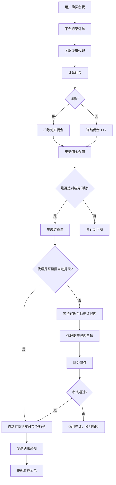
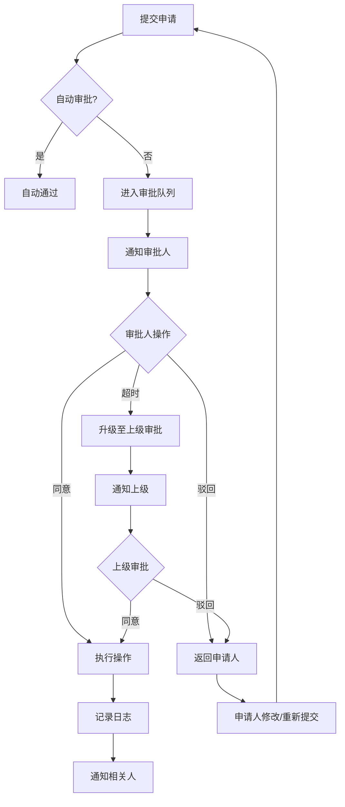

# 寰卓 团队管理计划

**版本**: v1.0  
**日期**: 2026-06-03  
**作者**: 小鹿 🦌  

---

## 1. 团队架构与角色体系

### 1.1 组织架构

```
                        ┌──────────────┐
                        │   董董/CEO    │
                        │  (战略决策)   │
                        └──────┬───────┘
                               │
            ┌──────────────────┼──────────────────┐
            │                  │                  │
     ┌──────┴──────┐   ┌──────┴──────┐   ┌──────┴──────┐
     │  运营总监    │   │  技术总监    │   │  商务总监    │
     │  (COO)      │   │  (CTO)      │   │  (CSO)      │
     └──────┬──────┘   └──────┬──────┘   └──────┬──────┘
            │                  │                  │
    ┌───────┴───────┐  ┌───────┴───────┐  ┌───────┴───────┐
    │ 产品运营      │  │ 后端开发       │  │ 渠道经理       │
    │ 内容运营      │  │ 前端开发       │  │ 大客户销售     │
    │ 数据分析师    │  │ 运维/安全      │  │ 客服主管       │
    │ 投放优化师    │  │ 测试工程师     │  │ 客服专员       │
    └───────────────┘  └───────────────┘  └───────────────┘
```

### 1.2 角色权限设计（RBAC详细矩阵）

| 角色 | 权限标识 | 数据可见范围 | 核心操作权限 | 审批权限 |
|------|----------|--------------|--------------|----------|
| **董董/CEO** | `ROLE_EXECUTIVE` | 全平台数据 | 查看所有报表、审批大额操作 | 渠道额度>5万、套餐价格调整、系统配置变更 |
| **运营总监** | `ROLE_COO` | 运营相关数据 | 运营配置、营销活动、内容管理 | 促销活动上线、渠道分润调整 |
| **技术总监** | `ROLE_CTO` | 技术相关数据 | 系统配置、部署、监控 | 架构变更、安全策略调整 |
| **商务总监** | `ROLE_CSO` | 商务相关数据 | 渠道管理、客户管理、合同 | 新渠道签约、大客户折扣 |
| **产品运营** | `ROLE_PRODUCT_OPS` | 产品数据 | 套餐管理、模型配置、定价 | 套餐上下架 |
| **内容运营** | `ROLE_CONTENT_OPS` | 内容数据 | 博客发布、帮助文档、页面文案 | 内容发布 |
| **数据分析师** | `ROLE_DATA_ANALYST` | 脱敏数据 | 数据看板、报表导出、分析 | 数据导出权限 |
| **投放优化师** | `ROLE_AD_OPS` | 投放数据 | 广告配置、落地页优化、A/B测试 | 广告预算调整 |
| **后端开发** | `ROLE_BACKEND_DEV` | 技术数据 | 代码部署、API调试、日志查看 | 生产环境发布（需审批） |
| **前端开发** | `ROLE_FRONTEND_DEV` | 技术数据 | 前端发布、UI调整 | 生产环境发布（需审批） |
| **运维/安全** | `ROLE_DEVOPS` | 系统数据 | 服务器管理、监控、安全策略 | 架构变更 |
| **测试工程师** | `ROLE_QA` | 测试数据 | 测试环境操作、Bug跟踪 | 测试环境发布 |
| **渠道经理** | `ROLE_CHANNEL_MGR` | 渠道数据 | 渠道审核、额度分配、结算 | 渠道额度<5万 |
| **大客户销售** | `ROLE_SALES_ENTERPRISE` | 客户数据 | 客户跟进、合同管理 | 企业折扣<30% |
| **客服主管** | `ROLE_SUPPORT_LEAD` | 客服数据 | 工单管理、退款审批、用户查询 | 退款<1000元 |
| **客服专员** | `ROLE_SUPPORT` | 客服数据 | 工单回复、用户查询、常见问题 | 无 |
| **渠道代理** | `ROLE_CHANNEL` | 仅自己渠道 | 用户管理、销售数据、佣金结算 | 无 |
| **财务** | `ROLE_FINANCE` | 财务数据 | 对账、结算、发票、报表 | 打款审批 |

---

## 2. 后台管理看板设计

### 2.1 总览仪表盘（董董/CEO专属）

```
┌─────────────────────────────────────────────────────────────┐
│  寰卓 总览仪表盘                    2026-06-03 09:00   │
├─────────────────────────────────────────────────────────────┤
│                                                             │
│  ┌─────────────┐  ┌─────────────┐  ┌─────────────┐         │
│  │ 今日收入     │  │ 今日订单     │  │ 今日活跃用户 │         │
│  │ ¥128,450    │  │ 342单       │  │ 8,932人     │         │
│  │ ↑ 23% vs 昨日│  │ ↑ 15%      │  │ ↑ 8%       │         │
│  └─────────────┘  └─────────────┘  └─────────────┘         │
│                                                             │
│  ┌─────────────┐  ┌─────────────┐  ┌─────────────┐         │
│  │ 本月收入     │  │ 本月利润     │  │ 渠道占比     │         │
│  │ ¥2.86M      │  │ ¥1.72M (60%)│  │ 直接: 45%  │         │
│  │ ↑ 31% vs 上月│  │ ↑ 28%      │  │ 渠道: 55%  │         │
│  └─────────────┘  └─────────────┘  └─────────────┘         │
│                                                             │
│  ┌─────────────────────────┐  ┌─────────────────────────┐   │
│  │ 收入趋势 (30天)         │  │ 用户增长趋势 (30天)      │   │
│  │  [折线图]              │  │  [折线图]               │   │
│  │  标准套餐 vs 经济套餐   │  │  新注册 vs 活跃用户      │   │
│  └─────────────────────────┘  └─────────────────────────┘   │
│                                                             │
│  ┌─────────────────────────┐  ┌─────────────────────────┐   │
│  │ 套餐销售分布             │  │ 模型调用排名             │   │
│  │  [饼图]                │  │  [柱状图]               │   │
│  │  体验/创作/专业/企业     │  │  qwen3.7/万相/快乐码    │   │
│  └─────────────────────────┘  └─────────────────────────┘   │
│                                                             │
│  ┌─────────────────────────┐  ┌─────────────────────────┐   │
│  │ 实时交易列表             │  │ 系统健康状态             │   │
│  │  [滚动列表]             │  │  [状态面板]             │   │
│  │  用户+金额+套餐+时间     │  │  API/DB/支付/阿里状态   │   │
│  └─────────────────────────┘  └─────────────────────────┘   │
│                                                             │
│  ┌─────────────────────────┐  ┌─────────────────────────┐   │
│  │ 异常告警 (最近24h)       │  │ 待审批事项               │   │
│  │  [告警列表]             │  │  [审批列表]             │   │
│  │  3条未处理              │  │  5项待审批              │   │
│  └─────────────────────────┘  └─────────────────────────┘   │
│                                                             │
└─────────────────────────────────────────────────────────────┘
```

### 2.2 数据看板指标清单

#### 2.2.1 收入与财务指标

| 指标名称 | 计算公式 | 更新频率 | 告警阈值 | 查看角色 |
|----------|----------|----------|----------|----------|
| 今日收入 | SUM(今日已支付订单金额) | 实时 | 低于昨日50% | 全员可见 |
| 今日订单数 | COUNT(今日订单) | 实时 | 低于昨日50% | 全员可见 |
| 今日客单价 | 今日收入 / 今日订单数 | 实时 | - | 全员可见 |
| 本月收入 | SUM(本月已支付订单) | 实时 | 低于上月同期20% | 高管/财务 |
| 本月利润 | 本月收入 - 本月成本 | 每日 | 低于预期30% | 高管/财务 |
| 毛利率 | (收入 - 成本) / 收入 × 100% | 实时 | 低于40% | 高管/财务 |
| 渠道收入占比 | 渠道订单金额 / 总收入 | 实时 | 单一渠道>50% | 高管/商务 |
| 退款率 | 退款金额 / 总收入 | 每日 | >5% | 运营/客服 |
| 退款金额 | SUM(退款订单) | 实时 | 单笔>1000元 | 客服主管 |
| ARPU（每用户平均收入） | 月收入 / 月活跃用户 | 每月 | 环比下降10% | 运营/高管 |
| LTV（用户生命周期价值） | 用户累计消费 / 用户数 | 每月 | - | 运营/高管 |
| 应收账款 | 渠道未结算金额 | 每日 | 超过30天 | 财务/商务 |

#### 2.2.2 用户增长指标

| 指标名称 | 计算公式 | 更新频率 | 告警阈值 | 查看角色 |
|----------|----------|----------|----------|----------|
| 今日新增用户 | COUNT(今日注册用户) | 实时 | 低于昨日50% | 运营/高管 |
| 今日活跃用户 | COUNT(今日有API调用用户) | 实时 | 低于昨日30% | 运营/高管 |
| DAU（日活跃用户） | 当日活跃用户 | 实时 | 连续3天下降 | 运营/高管 |
| MAU（月活跃用户） | 当月活跃用户 | 每日 | 环比下降10% | 运营/高管 |
| 注册转化率 | 注册用户 / 访客 | 每日 | 低于3% | 运营/投放 |
| 购买转化率 | 付费用户 / 注册用户 | 每日 | 低于5% | 运营/产品 |
| 7日留存率 | 7日内再次访问用户 / 7日前新增用户 | 每日 | 低于20% | 运营/产品 |
| 30日留存率 | 30日内再次访问用户 / 30日前新增用户 | 每日 | 低于10% | 运营/产品 |
| 付费用户留存率 | 30日内再次付费 / 30日前付费用户 | 每日 | 低于15% | 运营/产品 |
| 用户流失率 | 30日未活跃用户数 / 总用户数 | 每日 | 超过30% | 运营/高管 |
| NPS（净推荐值） | 推荐者% - 贬损者% | 每月 | 低于30 | 运营/高管 |
| 用户满意度 | 满意度评分平均分 | 每月 | 低于4.0 | 客服/运营 |

#### 2.2.3 产品运营指标

| 指标名称 | 计算公式 | 更新频率 | 告警阈值 | 查看角色 |
|----------|----------|----------|----------|----------|
| 套餐购买量 | 各套餐销售数量 | 实时 | 某套餐连续3天0单 | 产品运营 |
| 套餐转化率 | 套餐详情页购买 / 套餐详情页访问 | 每日 | 低于8% | 产品运营 |
| API调用次数 | 当日总调用次数 | 实时 | 异常波动>50% | 技术/运营 |
| Token消耗量 | 当日总Token消耗 | 实时 | 超过预算20% | 技术/运营 |
| 平均响应时间 | 所有API请求响应时间均值 | 实时 | >2s | 技术/运维 |
| 错误率 | 5xx错误 / 总请求 | 实时 | >1% | 技术/运维 |
| 模型调用分布 | 各模型调用次数占比 | 实时 | 单一模型>80% | 产品运营 |
| 热门模型TOP10 | 按调用次数排序 | 实时 | - | 产品运营 |
| 套餐升级率 | 升级用户 / 老用户 | 每周 | 低于5% | 产品运营 |
| 复购率 | 再次购买用户 / 总购买用户 | 每周 | 低于20% | 运营/高管 |
| 平均使用时长 | 用户活跃时长均值 | 每日 | 低于5分钟 | 产品运营 |
| 功能使用率 | 各功能使用人数占比 | 每周 | 新功能<10% | 产品运营 |

#### 2.2.4 渠道与销售指标

| 指标名称 | 计算公式 | 更新频率 | 告警阈值 | 查看角色 |
|----------|----------|----------|----------|----------|
| 渠道数量 | 活跃渠道数 | 实时 | 低于10个 | 商务/高管 |
| 渠道销售额 | 各渠道订单金额 | 实时 | 某渠道连续7天0单 | 渠道经理 |
| 渠道佣金支出 | SUM(渠道佣金) | 每日 | 超过预算20% | 财务/商务 |
| 渠道新增用户 | 渠道发展的用户数量 | 每日 | 低于预期 | 渠道经理 |
| 渠道转化率 | 渠道推广点击→购买 | 每日 | 低于2% | 渠道经理 |
| 大客户数量 | 企业定制客户数 | 每周 | 低于5个 | 商务总监 |
| 大客户合同金额 | 企业合同总金额 | 每周 | 低于目标 | 商务总监 |
| 客户成功健康度 | 综合活跃度评分 | 每周 | 低于60分 | 客户成功 |
| 渠道层级深度 | 平均代理层级数 | 每周 | 超过3层 | 商务/高管 |
| 渠道冲突率 | 同一用户被多渠道关联 | 每周 | >5% | 渠道经理 |

#### 2.2.5 技术运维指标

| 指标名称 | 计算公式 | 更新频率 | 告警阈值 | 查看角色 |
|----------|----------|----------|----------|----------|
| 系统可用性 | 正常运行时间 / 总时间 | 实时 | <99.9% | 技术/运维 |
| API网关QPS | 每秒请求数 | 实时 | 超过容量80% | 技术/运维 |
| 数据库连接数 | 当前连接数 | 实时 | 超过80% | 技术/运维 |
| 缓存命中率 | 缓存命中 / 总请求 | 实时 | <80% | 技术/运维 |
| 服务器CPU使用率 | CPU使用百分比 | 实时 | >80% | 技术/运维 |
| 服务器内存使用率 | 内存使用百分比 | 实时 | >80% | 技术/运维 |
| 支付成功率 | 成功支付 / 发起支付 | 实时 | <95% | 技术/运营 |
| 短信到达率 | 成功发送 / 发送总数 | 每日 | <95% | 技术/运营 |
| 阿里云API延迟 | 调用阿里ModelRouter耗时 | 实时 | >3s | 技术/运维 |
| 安全事件数 | 攻击/异常登录等 | 实时 | >0 | 技术/安全 |
| 日志存储量 | 当日日志大小 | 每日 | 超过1TB | 技术/运维 |
| 备份状态 | 最近一次备份时间 | 每日 | 超过24h | 技术/运维 |

---

## 3. 智能分析系统

### 3.1 异常预警系统

#### 3.1.1 预警规则配置

| 预警级别 | 规则名称 | 触发条件 | 通知方式 | 响应时间 |
|----------|----------|----------|----------|----------|
| **P0-紧急** | 系统宕机 | API网关5分钟无响应 | 短信+电话+钉钉 | 5分钟 |
| **P0-紧急** | 支付异常 | 支付成功率<80% 持续10分钟 | 短信+钉钉 | 10分钟 |
| **P0-紧急** | 数据异常 | 余额扣减异常（负数/超额） | 短信+钉钉 | 5分钟 |
| **P0-紧急** | 安全告警 | 异常登录/暴力破解 | 短信+钉钉 | 5分钟 |
| **P1-重要** | 收入下降 | 今日收入<昨日50% | 钉钉 | 30分钟 |
| **P1-重要** | 用户激增 | 注册量>平日3倍 | 钉钉 | 30分钟 |
| **P1-重要** | API延迟 | 平均响应>2秒持续15分钟 | 钉钉 | 15分钟 |
| **P1-重要** | 错误率升高 | 5xx错误>1%持续10分钟 | 钉钉 | 15分钟 |
| **P1-重要** | 渠道异常 | 单一渠道连续7天0销售 | 钉钉 | 24h |
| **P2-优化** | 转化下降 | 购买转化率<3%连续3天 | 邮件+钉钉 | 24h |
| **P2-优化** | 留存下降 | 7日留存<20%连续3天 | 邮件+钉钉 | 24h |
| **P2-优化** | 退款升高 | 退款率>3%连续3天 | 邮件+钉钉 | 24h |
| **P2-优化** | 库存预警 | 阿里云Token余额<10万 | 邮件 | 24h |
| **P2-优化** | 成本升高 | 单笔调用成本>均值20% | 邮件 | 24h |

#### 3.1.2 预警通知模板

```
【P0紧急】寰卓系统异常告警
━━━━━━━━━━━━━━━━━━━━━━━━━━━━
告警时间: 2026-06-03 14:32:15
告警类型: 支付异常
触发条件: 支付成功率 72% (持续12分钟)
影响范围: 全部用户
当前状态: 持续中
建议操作: 1.检查支付宝SDK 2.查看订单日志 3.通知用户
━━━━━━━━━━━━━━━━━━━━━━━━━━━━
点击查看详情: https://admin.tokenhub.cn/alerts/ALERT-20260603-001
```

### 3.2 趋势分析

#### 3.2.1 预测模型

| 分析维度 | 预测内容 | 算法/方法 | 输出周期 | 应用场景 |
|----------|----------|----------|----------|----------|
| 收入预测 | 未来7天/30天收入 | 时间序列 (ARIMA + 节假日因子) | 每日 | 财务规划、阿里云采购 |
| 用户增长 | 未来30天新增用户 | 回归模型 + 投放计划因子 | 每日 | 服务器扩容、运营排期 |
| 留存预测 | 新增用户30日留存 | 用户行为聚类 + 生存分析 | 每周 | 运营策略调整 |
| 流失预警 | 用户7日内流失概率 | 随机森林 + 用户行为特征 | 实时 | 自动化挽留 |
| 用量预测 | 未来7天Token消耗 | 滑动平均 + 趋势分解 | 每日 | 阿里云余额充值 |
| 渠道增长 | 各渠道未来销售额 | 渠道历史 + 季节因子 | 每周 | 渠道激励调整 |
| 异常检测 | 识别异常交易/用户 | 孤立森林 + 规则引擎 | 实时 | 风控、反作弊 |
| 套餐偏好 | 用户最可能购买的套餐 | 协同过滤 + 用户画像 | 实时 | 个性化推荐 |

#### 3.2.2 趋势分析看板示例

```
┌─────────────────────────────────────────────────────────────┐
│  趋势分析中心                                               │
├─────────────────────────────────────────────────────────────┤
│                                                             │
│  收入预测 (未来30天)                                        │
│  ┌────────────────────────────────────────────────────┐   │
│  │ 预测收入: ¥3.2M (+12% vs 当前)                       │   │
│  │ 置信区间: ¥2.9M - ¥3.5M                             │   │
│  │ 关键驱动: 抖音投放增加 + 新渠道上线                    │   │
│  │ 风险提示: 端午节假期可能下降15%                         │   │
│  └────────────────────────────────────────────────────┘   │
│                                                             │
│  用户留存预测                                               │
│  ┌────────────────────────────────────────────────────┐   │
│  │ 今日新增用户: 1,250人                                │   │
│  │ 预测7日留存: 28% (±3%)                               │   │
│  │ 预测30日留存: 14% (±2%)                              │   │
│  │ 高流失风险用户: 156人 (活跃度<3分)                     │   │
│  └────────────────────────────────────────────────────┘   │
│                                                             │
│  流失预警列表                                               │
│  ┌────────────────────────────────────────────────────┐   │
│  │ 用户ID     最后活跃    流失概率    建议动作          │   │
│  │ U-12845    3天前      87%        发送优惠券          │   │
│  │ U-98231    5天前      82%        推送教程            │   │
│  │ U-45123    7天前      78%        客服电话回访        │   │
│  │ ...        ...        ...        ...                │   │
│  └────────────────────────────────────────────────────┘   │
│                                                             │
│  异常交易检测                                               │
│  ┌────────────────────────────────────────────────────┐   │
│  │ 检测到 3 笔异常交易                                     │   │
│  │ 订单#20260603-8821: 单笔¥5,000 (超出套餐均值10倍)      │   │
│  │ 订单#20260603-8835: 同一IP 30秒内创建5个订单           │   │
│  │ 订单#20260603-8842: 信用卡拒付后换卡重试               │   │
│  └────────────────────────────────────────────────────┘   │
│                                                             │
└─────────────────────────────────────────────────────────────┘
```

### 3.3 用户画像系统

#### 3.3.1 用户标签体系

| 标签类别 | 标签示例 | 数据来源 | 更新频率 |
|----------|----------|----------|----------|
| **基础属性** | 性别、年龄、城市、注册渠道 | 注册信息、IP定位 | 注册时 |
| **设备属性** | 设备类型、浏览器、操作系统 | 前端采集 | 每次访问 |
| **消费能力** | 高/中/低 (按消费金额分) | 订单数据 | 实时 |
| **付费意愿** | 强/中/弱 (按浏览行为预测) | 页面行为 | 每日 |
| **活跃程度** | 核心/活跃/沉默/流失 | 登录+调用行为 | 每日 |
| **模型偏好** | 文本党/视频党/全能型 | 用量数据 | 实时 |
| **套餐偏好** | 体验型/创作型/专业型/企业型 | 订单数据 | 实时 |
| **渠道来源** | 抖音/快手/百度/渠道代理/自然流量 | 推广参数 | 注册时 |
| **使用场景** | 短剧创作/自媒体/学生/企业 | 用量模式+调研 | 每周 |
| **价格敏感** | 敏感/一般/不敏感 | 促销响应+套餐选择 | 每周 |
| **技术能力** | 小白/进阶/开发者 | Playground使用模式 | 每周 |
| **社交传播** | 推荐者/被动接收者 | 推荐计划参与 | 实时 |
| **生命周期** | 新客/成长/成熟/衰退/流失 | 综合行为 | 每日 |
| **LTV等级** | A/B/C/D (按LTV预测分) | 消费预测模型 | 每周 |
| **风险等级** | 正常/关注/高危 (退款/投诉) | 客服数据 | 每日 |

#### 3.3.2 用户分群模型

| 用户群体 | 特征描述 | 占比 | 核心诉求 | 运营策略 |
|----------|----------|------|----------|----------|
| **价格敏感型** | 选择经济套餐、关注促销、使用闲时算力 | 40% | 低价、性价比 | 推送经济套餐、限时优惠 |
| **内容创作型** | 高频视频/图片调用、选择创作/专业套餐 | 25% | 生成质量、效率 | 推送新模型、创作教程 |
| **技术探索型** | 使用多种模型、API调用方式多样 | 15% | 技术文档、SDK | 推送技术博客、新功能 |
| **企业效率型** | 稳定高频调用、选择企业套餐 | 10% | 稳定性、SLA | 专属客服、SLA保障 |
| **尝鲜体验型** | 仅购买体验卡、调用次数少 | 8% | 简单体验、低门槛 | 引导升级、使用教程 |
| **高价值沉睡型** | 曾高消费、近期无活跃 | 2% | 激活、回归 | 大额优惠券、专属客服回访 |

#### 3.3.3 用户画像看板

```
┌─────────────────────────────────────────────────────────────┐
│  用户画像分析                                               │
├─────────────────────────────────────────────────────────────┤
│                                                             │
│  用户总量: 45,832人                                         │
│  ┌────────────────────────────────────────────────────┐   │
│  │ 分群饼图                                              │   │
│  │ 价格敏感型 ████████████████████ 40%                  │   │
│  │ 内容创作型 ██████████████ 25%                        │   │
│  │ 技术探索型 ████████ 15%                             │   │
│  │ 企业效率型 █████ 10%                                │   │
│  │ 尝鲜体验型 ████ 8%                                  │   │
│  │ 高价值沉睡 █ 2%                                     │   │
│  └────────────────────────────────────────────────────┘   │
│                                                             │
│  用户画像示例: U-12845 (内容创作型)                         │
│  ┌────────────────────────────────────────────────────┐   │
│  │ 基础: 女, 28岁, 杭州, 抖音来源                       │   │
│  │ 消费: ¥599 (专业套餐), 月均消费¥200                   │   │
│  │ 偏好: 视频生成(70%), 图片(20%), 文本(10%)            │   │
│  │ 活跃: 每日登录, 月均调用500次                         │   │
│  │ 特征: 凌晨2-4点活跃（创作者作息）                      │   │
│  │ 风险: 低, 无退款/投诉记录                             │   │
│  │ 推荐: 推送视频模型更新、创作者社区邀请                  │   │
│  └────────────────────────────────────────────────────┘   │
│                                                             │
│  用户生命周期分布                                           │
│  ┌────────────────────────────────────────────────────┐   │
│  │ 新客: 1,250人 (本周)     ████████                  │   │
│  │ 成长: 8,500人            ████████████████████      │   │
│  │ 成熟: 28,000人           ████████████████████████████│   │
│  │ 衰退: 5,800人            ██████                     │   │
│  │ 流失: 2,282人            ██                         │   │
│  └────────────────────────────────────────────────────┘   │
│                                                             │
└─────────────────────────────────────────────────────────────┘
```

---

## 4. 渠道管理与佣金结算

### 4.1 渠道管理体系

#### 4.1.1 渠道层级设计

```
                    ┌─────────────┐
                    │  寰卓  │
                    │   平台       │
                    └──────┬──────┘
                           │
              ┌────────────┼────────────┐
              │            │            │
        ┌─────┴─────┐ ┌──┴─────┐ ┌────┴────┐
        │ 一级代理A  │ │ 一级代理B│ │ 一级代理C│
        │ 分润: 30%  │ │ 分润: 25%│ │ 分润: 20%│
        └─────┬─────┘ └────────┘ └─────────┘
              │
       ┌──────┴──────┐
       │             │
   ┌───┴───┐   ┌─────┴─────┐
   │ 二级代理A1│   │ 二级代理A2│
   │ 分润: 15%│   │ 分润: 15%│
   └────────┘   └──────────┘
```

#### 4.1.2 渠道类型与权限

| 渠道类型 | 门槛要求 | 分润比例 | 额度上限 | 下级代理 | 专属功能 |
|----------|----------|----------|----------|----------|----------|
| **普通代理** | 注册即可 | 15-20% | ¥1万/月 | 无 | 推广链接、基础数据 |
| **认证代理** | 营业执照+审核 | 20-25% | ¥5万/月 | 可发展2级 | 营销素材、培训支持 |
| **金牌代理** | 月销>10万 | 25-30% | ¥20万/月 | 可发展3级 | 专属客服、优先结算 |
| **战略合作** | 年销>100万 | 30-35%（协商） | 无上限 | 可发展多级 | 定制套餐、联合品牌 |
| **企业代理** | 企业资质+预付 | 20-30% | 按预付 | 可发展 | 企业发票、合同 |

#### 4.1.3 渠道后台功能清单

```
渠道后台 (partner.tokenhub.cn)
│
├── 仪表盘
│   ├── 额度余额（实时）
│   ├── 今日销售/本月销售
│   ├── 新增用户/总用户
│   ├── 佣金累计/可提现
│   └── 下级代理数量
│
├── 用户管理
│   ├── 我的用户列表（分页/搜索/筛选）
│   ├── 用户详情（消费记录、API Key）
│   ├── 用户消费统计（按时间/套餐）
│   └── 用户激活状态
│
├── 销售数据
│   ├── 销售趋势图（日/周/月）
│   ├── 套餐销售分布
│   ├── 用户留存分析
│   ├── 转化率漏斗
│   └── 数据导出（Excel/CSV）
│
├── 佣金结算
│   ├── 佣金明细（每笔订单对应佣金）
│   ├── 结算周期（T+7/月结）
│   ├── 提现申请（支付宝/银行卡）
│   ├── 提现记录
│   └── 发票管理
│
├── 营销工具
│   ├── 推广链接生成（带渠道标识）
│   ├── 推广二维码生成
│   ├── 落地页定制（可选模板）
│   ├── 素材库（海报/文案/视频）
│   ├── 优惠券创建（限额度内）
│   └── 活动配置
│
├── 下级代理（多级分销）
│   ├── 代理邀请（生成邀请码）
│   ├── 代理列表（下级/下下级）
│   ├── 代理业绩统计
│   ├── 代理分润配置（从代理佣金中分）
│   └── 代理培训资料
│
└── 账户设置
    ├── 基本信息
    ├── 收款账户（支付宝/银行卡）
    ├── 安全设置（密码/手机）
    ├── 通知偏好
    └── 合同/协议查看
```

### 4.2 佣金结算体系

#### 4.2.1 结算规则

| 结算项 | 规则 | 说明 |
|--------|------|------|
| **结算周期** | T+7 / T+30 | 默认T+7，金牌代理可协商T+1 |
| **结算方式** | 支付宝/银行卡 | 自动打款或手动申请 |
| **最低提现额** | ¥100 | 低于100元累计到下一周期 |
| **佣金计算** | 订单实付金额 × 分润比例 | 退款订单扣除对应佣金 |
| **税费处理** | 代扣代缴 / 自理 | 企业代理提供发票，个人代扣20% |
| **对账机制** | 每日自动对账 | 差异>1%自动告警 |
| **争议处理** | 48小时申诉期 | 客服介入调查 |

#### 4.2.2 佣金计算示例

```
场景：一级代理A（分润30%）发展了用户U，用户U购买了¥199专业套餐

计算过程：
1. 用户U支付 ¥199
2. 平台成本（阿里云7折）= ¥199 × 70% = ¥139.3
3. 平台毛利 = ¥199 - ¥139.3 = ¥59.7
4. 代理A佣金 = ¥199 × 30% = ¥59.7
   → 此时平台毛利为 0，需从其他收入补贴
5. 实际建议：代理佣金从平台毛利中分配
   → 代理佣金 = ¥59.7 × 50% = ¥29.85
   → 平台留存 = ¥59.7 × 50% = ¥29.85

如果代理A还有二级代理A1（从A的佣金中分50%）：
6. 代理A1佣金 = ¥29.85 × 50% = ¥14.925
7. 代理A实得 = ¥29.85 - ¥14.925 = ¥14.925
```

#### 4.2.3 结算流程



### 4.3 渠道冲突与防作弊

| 冲突类型 | 规则 | 处理机制 |
|----------|------|----------|
| **用户归属** | 首次点击的渠道优先，30天Cookie有效期 | 超过30天可重新归属 |
| **多设备** | 同一用户多设备，统一归属 | 以注册时的渠道为准 |
| **自然流量** | 无渠道标识的用户归属平台 | 不参与渠道分润 |
| **自购套利** | 代理用自己的链接购买 | 佣金扣除，警告处理 |
| **虚假用户** | 刷注册/刷订单 | 冻结佣金，封号处理 |
| **跨渠道抢客** | 诱导用户更换渠道 | 禁止，发现扣除佣金 |
| **价格冲突** | 代理私自降价 | 违约处理，取消代理资格 |

---

## 5. 数据看板详细设计

### 5.1 运营看板（运营团队）

```
┌─────────────────────────────────────────────────────────────┐
│  运营看板                              刷新时间: 09:00      │
├─────────────────────────────────────────────────────────────┤
│                                                             │
│  核心指标                                                    │
│  ┌─────────────┐ ┌─────────────┐ ┌─────────────┐         │
│  │ 新注册      │ │ 今日付费     │ │ 转化率      │         │
│  │ 1,250       │ │ 342         │ │ 5.2%        │         │
│  │ ↑ 12%      │ │ ↑ 23%      │ │ ↑ 0.3%     │         │
│  └─────────────┘ └─────────────┘ └─────────────┘         │
│                                                             │
│  流量来源分析                                                │
│  ┌────────────────────────────────────────────────────┐   │
│  │ 抖音 45% ██████████████████████████████            │   │
│  │ 快手 20% ██████████████                             │   │
│  │ 百度 15% █████████                                  │   │
│  │ 自然 10% ██████                                     │   │
│  │ 渠道 10% ██████                                     │   │
│  └────────────────────────────────────────────────────┘   │
│                                                             │
│  套餐销售分布                                                │
│  ┌────────────────────────────────────────────────────┐   │
│  │ 体验卡 35% █████████████████████                   │   │
│  │ 创作卡 40% ████████████████████████████            │   │
│  │ 专业卡 20% ██████████████████                      │   │
│  │ 企业卡  5% █████                                    │   │
│  └────────────────────────────────────────────────────┘   │
│                                                             │
│  A/B测试进行中                                             │
│  ┌────────────────────────────────────────────────────┐   │
│  │ 测试: 首页按钮文案                                      │   │
│  │ 方案A "立即购买" 转化率 4.8%                         │   │
│  │ 方案B "免费体验" 转化率 5.2% (胜出)                  │   │
│  │ 置信度: 95%                                          │   │
│  └────────────────────────────────────────────────────┘   │
│                                                             │
└─────────────────────────────────────────────────────────────┘
```

### 5.2 技术看板（技术团队）

```
┌─────────────────────────────────────────────────────────────┐
│  技术运维看板                          刷新时间: 实时      │
├─────────────────────────────────────────────────────────────┤
│                                                             │
│  系统状态                                                    │
│  ┌─────────────┐ ┌─────────────┐ ┌─────────────┐         │
│  │ API网关     │ │ 数据库      │ │ 支付服务     │         │
│  │ 🟢 正常     │ │ 🟢 正常     │ │ 🟢 正常     │         │
│  │ QPS: 1,200  │ │ 连接: 45   │ │ 成功率:99.8%│         │
│  └─────────────┘ └─────────────┘ └─────────────┘         │
│                                                             │
│  性能监控                                                    │
│  ┌────────────────────────────────────────────────────┐   │
│  │ 平均响应时间: 180ms (目标<200ms)                     │   │
│  │ P95响应时间:  450ms (目标<500ms)                     │   │
│  │ 错误率: 0.12% (目标<1%)                             │   │
│  │ 并发数: 1,200 (容量: 5,000)                         │   │
│  └────────────────────────────────────────────────────┘   │
│                                                             │
│  阿里云/ModelRouter状态                                     │
│  ┌────────────────────────────────────────────────────┐   │
│  │ 调用成功率: 99.7%                                   │   │
│  │ 平均延迟: 320ms                                     │   │
│  │ 余额: ¥86,500 (预警线: ¥50,000)                     │   │
│  │ 预计耗尽: 7天后                                     │   │
│  └────────────────────────────────────────────────────┘   │
│                                                             │
│  日志与告警                                                  │
│  ┌────────────────────────────────────────────────────┐   │
│  │ 最近告警:                                            │   │
│  │ 14:32 支付延迟  2.1s  已恢复                        │   │
│  │ 12:15 缓存miss 15%  已优化                         │   │
│  │ 09:00 日对账完成  差异: ¥0.00                      │   │
│  └────────────────────────────────────────────────────┘   │
│                                                             │
└─────────────────────────────────────────────────────────────┘
```

### 5.3 商务看板（渠道/销售团队）

```
┌─────────────────────────────────────────────────────────────┐
│  商务看板                              刷新时间: 09:00      │
├─────────────────────────────────────────────────────────────┤
│                                                             │
│  渠道业绩排名 (本月)                                         │
│  ┌────────────────────────────────────────────────────┐   │
│  │ 排名 渠道名称     销售额    用户    佣金     状态  │   │
│  │  1   代理A       ¥185,000  892    ¥46,250  🟢    │   │
│  │  2   代理B       ¥128,000  645    ¥32,000  🟢    │   │
│  │  3   代理C       ¥95,000   423    ¥23,750  🟡    │   │
│  │  4   代理D       ¥42,000   156    ¥10,500  🔴    │   │
│  └────────────────────────────────────────────────────┘   │
│                                                             │
│  大客户状态                                                  │
│  ┌────────────────────────────────────────────────────┐   │
│  │ 客户        合同金额    剩余额度    健康度    状态   │   │
│  │ 某MCN机构   ¥50,000    ¥32,000    85分     🟢    │   │
│  │ 某短剧公司  ¥30,000    ¥8,000     62分     🟡    │   │
│  │ 某高校      ¥20,000    ¥18,500    95分     🟢    │   │
│  └────────────────────────────────────────────────────┘   │
│                                                             │
│  待办事项                                                    │
│  ┌────────────────────────────────────────────────────┐   │
│  │ 3个新渠道申请待审核                                    │   │
│  │ 2个大客户续约提醒 (7天内到期)                          │   │
│  │ 5笔渠道提现申请待审批                                  │   │
│  │ 1个渠道投诉待处理                                      │   │
│  └────────────────────────────────────────────────────┘   │
│                                                             │
└─────────────────────────────────────────────────────────────┘
```

---

## 6. 后台管理模块详细设计

### 6.1 模块权限配置表

| 后台模块 | 运营 | 技术 | 客服 | 财务 | 商务 | 高管 | 超管 |
|----------|------|------|------|------|------|------|------|
| 总览仪表盘 | 查看 | 查看 | 查看 | 查看 | 查看 | 查看 | 管理 |
| 模型管理 | 管理 | 管理 | - | - | - | - | 管理 |
| 套餐管理 | 管理 | - | - | - | - | 审批 | 管理 |
| 用户管理 | 查看 | 查看 | 查看 | 查看 | 查看 | 查看 | 管理 |
| 渠道管理 | 查看 | - | - | - | 管理 | 审批 | 管理 |
| API Key管理 | 查看 | 管理 | - | - | - | - | 管理 |
| 订单管理 | 查看 | 查看 | 处理 | 查看 | - | 查看 | 管理 |
| 财务中心 | 查看 | - | - | 管理 | - | 查看 | 管理 |
| 用量监控 | 查看 | 管理 | - | - | - | 查看 | 管理 |
| 计费规则 | 管理 | - | - | - | - | - | 管理 |
| 智能分析 | 查看 | 查看 | - | - | 查看 | 查看 | 管理 |
| 营销管理 | 管理 | - | - | - | 查看 | 查看 | 管理 |
| 内容管理 | 管理 | - | - | - | - | - | 管理 |
| 系统配置 | 查看 | 管理 | - | - | - | - | 管理 |
| 日志审计 | - | 查看 | - | - | - | 查看 | 管理 |

### 6.2 审批工作流

| 审批事项 | 申请人 | 审批人 | 抄送人 | 时限 | 条件 |
|----------|--------|--------|--------|------|------|
| 新渠道入驻 | 商务/渠道 | 运营总监 | 商务总监 | 48h | 资质审核通过 |
| 渠道额度>5万 | 渠道经理 | 董董 | 财务 | 24h | 渠道历史无违约 |
| 套餐价格调整 | 产品运营 | 董董 | 运营/商务 | 24h | 毛利率不得低于40% |
| 大额退款>1000 | 客服主管 | 运营总监 | 财务 | 24h | 需提供退款理由 |
| 生产环境发布 | 技术 | 技术总监 | 全员 | 2h | 需通过测试环境验证 |
| 系统配置变更 | 技术 | 技术总监 | 董董 | 2h | 需记录变更日志 |
| 促销活动上线 | 运营 | 运营总监 | 商务/财务 | 24h | 预算审批通过 |
| 数据导出 | 数据分析师 | 董董 | - | 24h | 脱敏处理 |
| 账号权限变更 | 超管 | 董董 | - | 4h | 需记录原因 |
| 阿里云大额充值 | 技术 | 董董 | 财务 | 4h | 余额低于预警线 |

### 6.3 审批流程图



---

## 7. 自动化与智能化工具

### 7.1 自动化运营规则

| 规则名称 | 触发条件 | 自动执行 | 人工介入点 |
|----------|----------|----------|------------|
| 新用户欢迎 | 注册完成 | 发送欢迎邮件+新手引导 | 无 |
| 余额预警 | 余额<20% | 站内信+短信提醒 | 无 |
| 余额耗尽 | 余额=0 | 暂停API Key + 提醒充值 | 客服可手动恢复 |
| 沉默唤醒 | 7天未活跃 | 发送优惠券邮件 | 运营可调整优惠力度 |
| 流失挽回 | 30天未活跃 | 发送大额优惠券 | 运营可调整阈值 |
| 复购引导 | 套餐剩余<30% | 推送续费优惠 | 无 |
| 升级推荐 | 体验卡用户调用>50次 | 推送创作卡优惠 | 无 |
| 渠道佣金结算 | 达到结算周期 | 自动生成结算单 | 财务审核后打款 |
| 阿里云充值 | 余额<预警线 | 自动申请充值（需审批） | 董董审批 |
| 对账异常 | 差异>1% | 自动告警 + 生成差异报告 | 财务介入调查 |
| 系统扩容 | CPU>80% 持续10分钟 | 自动扩容K8s Pod | 技术确认 |
| 异常用户 | 调用模式异常 | 标记风险 + 限制调用 | 安全团队调查 |

### 7.2 智能推荐引擎

| 推荐场景 | 推荐内容 | 算法 | 触发时机 |
|----------|----------|------|----------|
| 套餐推荐 | 根据用户画像推荐最适合的套餐 | 协同过滤 + 内容过滤 | 用户进入套餐页 |
| 模型推荐 | 推荐用户可能需要的模型 | 基于调用历史的关联分析 | 用户在模型广场 |
| 充值提醒 | 预测用户何时需要充值 | 基于用量消耗的时序预测 | 余额<50%时 |
| 优惠推送 | 推送最可能转化的优惠券 | 用户响应预测模型 | 用户犹豫/流失时 |
| 内容推荐 | 推荐用户感兴趣的教程/博客 | 基于用户标签的内容匹配 | 用户访问帮助中心 |
| 渠道激励 | 推荐渠道最适合推广的套餐 | 渠道用户画像匹配 | 渠道登录后台 |
| 升级时机 | 预测最佳套餐升级时机 | 用量消耗速度预测 | 套餐剩余30% |
| 交叉销售 | 文本用户推荐视频生成 | 用户画像关联分析 | 用户购买后 |

---

## 8. 实施建议

### 8.1 开发优先级

| 阶段 | 时间 | 重点模块 | 目标 |
|------|------|----------|------|
| **第一阶段** | 1-2周 | 基础看板、用户管理、订单管理 | 运营团队能正常使用 |
| **第二阶段** | 3-4周 | 渠道后台、佣金结算、财务管理 | 渠道体系能运转 |
| **第三阶段** | 5-6周 | 智能分析、预警系统、用户画像 | 自动化运营启动 |
| **第四阶段** | 7-8周 | 预测分析、推荐引擎、审批流 | 智能化运营成熟 |

### 8.2 数据埋点规范

| 埋点类型 | 事件名称 | 采集字段 | 用途 |
|----------|----------|----------|------|
| 页面浏览 | `page_view` | 页面路径、来源、停留时长 | 流量分析 |
| 按钮点击 | `button_click` | 按钮名称、页面、用户 | 转化分析 |
| 套餐浏览 | `package_view` | 套餐ID、价格、用户 | 兴趣分析 |
| 购买转化 | `purchase` | 套餐ID、金额、渠道、优惠 | 收入分析 |
| API调用 | `api_call` | 模型、Token数、响应时间 | 用量分析 |
| 注册 | `register` | 来源、渠道、设备 | 增长分析 |
| 登录 | `login` | 方式、设备、频率 | 活跃分析 |
| 错误 | `error` | 错误类型、页面、用户 | 质量分析 |
| 搜索 | `search` | 关键词、结果数、点击率 | 需求分析 |
| 分享 | `share` | 平台、内容、用户 | 传播分析 |

---

*文档生成日期: 2026-06-03*  
*生成人: 小鹿 🦌*
